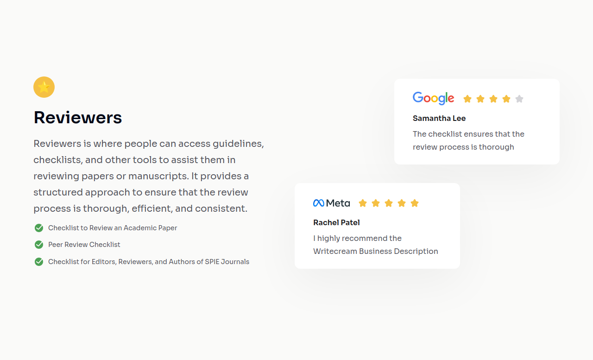

# devChallenges - Testimonial Page



Personal solution to the Testimonial Page challenge from devChallenges: [Testimonial Page | devChallenges.io | Real-life Coding Projects to become a Software Engineer](https://devchallenges.io/challenge/testimonial-page)

**NOTE: I didn't break down the page into multiple components in order to save time.**

## Developing

**Requirements:**

-   Node.js (see version in `.tool-versions`)
-   pnpm

**Useful commands:**

```bash
# Install dependencies
pnpm install

# Start development server
pnpm run dev

# Lint
pnpm run lint

# Build
pnpm run build

# Preview last build
pnpm run preview
```
